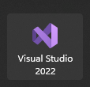
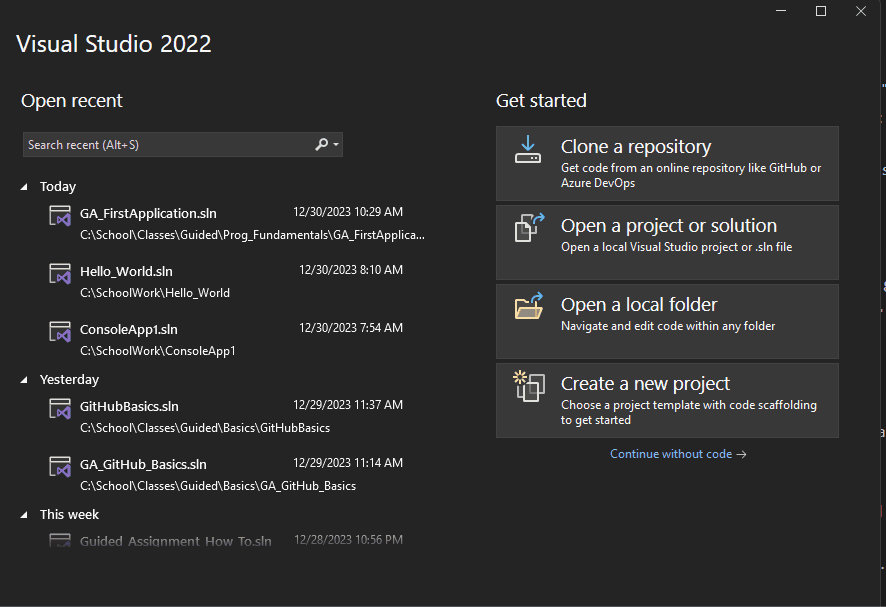
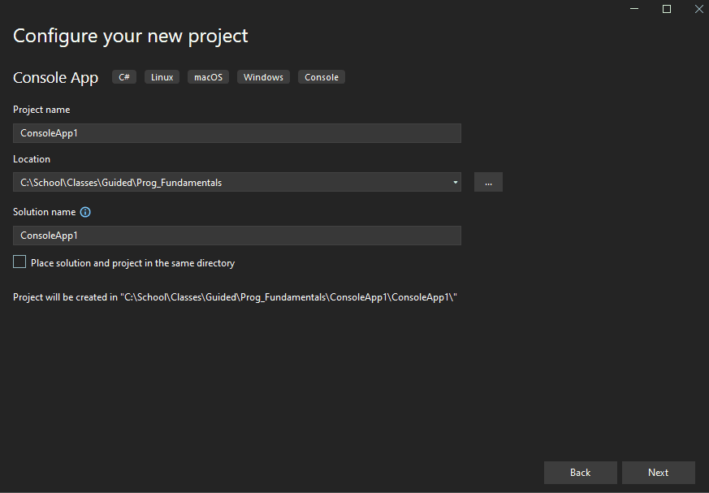
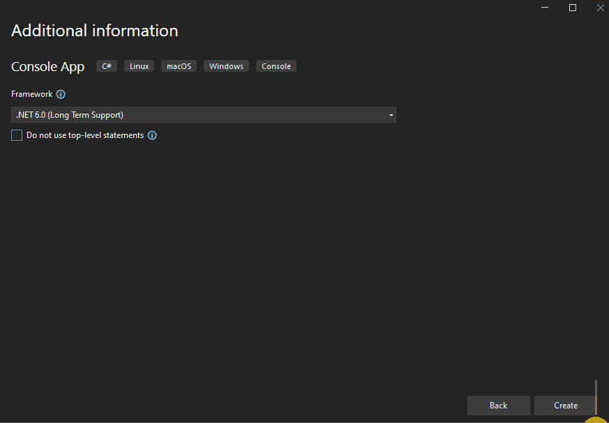
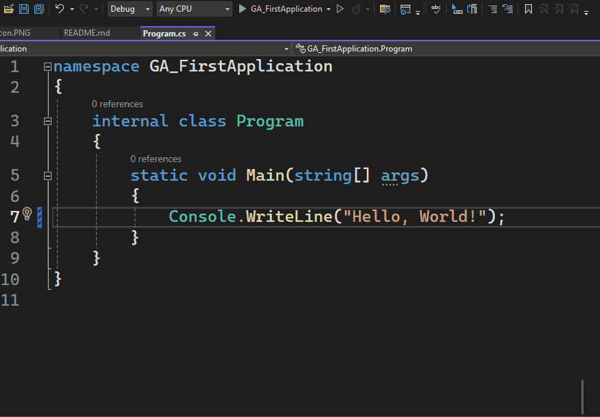
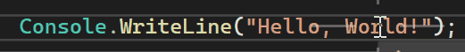
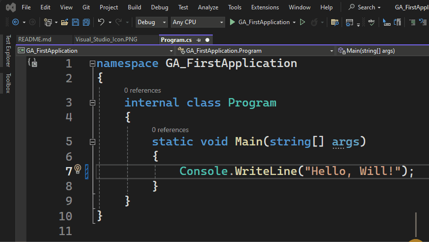

# Guided Assignment: Creating Your First CSharp Console Application


## Information

This tutorial guides you through creating your very first C console application using Visual Studio 2022. Ensure you have Visual Studio 2022 installed on your computer.

### Your Goals:
- Understand how to create a new project in Visual Studio
    - Give a project a proper name
    - Where to save it
    - How to choose the right template
- How to Run your code
- How to change your code and save the changes

---
## Requirements

1. Create a new Visual Studio Project
    - Give a it a name ( no spaces )
    - Save it in an easy to find folder
2. Run your project with no errors. ( Hotkey F5 )
3. Change the starting message `Hello, World!` to `Hello, Your Name!`.
4. Save your project
5. Run your project ( it should now display your new message ).
6. Type DONE in the submission text box on canvas and submit.

--- 
## Step By Step

### Step 1: Open Visual Studio
- Open Visual Studio, either from the desktop icon or through the Start menu.



### Step 2: Create a New Project
1. Click on "Create a New Project."
2. In the dropdown menus:
   - Select C# language.
   - Search for "console" in the template search bar.
   - Choose "Console App" (not ".NET Framework") and click "Next."



### Step 3: Configure Your New Project
1. Give your project a name (e.g., "Hello_World").
2. Choose a folder to save it in (recommended: create a dedicated folder for C projects).
3. Check the "Place solution and project in the same directory" option.
4. Click "Next."



### Step 4: Additional Information
1. Keep a framework between .NET 6 and .NET 8 selected.
2. Check the "Do not use top-level statements" checkbox.
3. Click "Create."



### Step 5: Run Your Application
1. Your Visual Studio application opens with starter code.

```csharp
namespace GA_FirstApplication // This is the name of your project
{
    internal class Program
    {
        static void Main(string[] args)
        {
            Console.WriteLine("Hello, World!");
        }
    }
}
```

2. To run your application:
   - Click the green arrow in the top toolbar.
   - Alternatively, use the hotkey: F5.



### Step 6: Edit, Save, and Run your Code


1. The default output is "Hello World." Edit it by double-clicking on "world," replacing it with your name.



2. To save your application:
   - Click "File" in the upper left corner.
   - Select "Save All" (hotkey: Ctrl + S or Ctrl + Shift + S).
3. Run your program again (hotkey: F5).



### Step 7: Type DONE in the submission text box on canvas

---

## Rubric